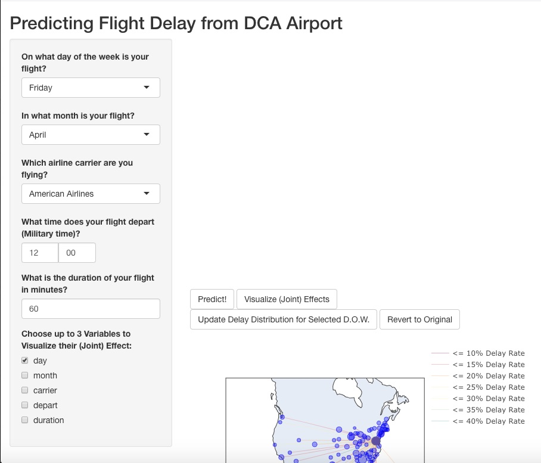

# flight-prediction

<!-- PROJECT LOGO -->
 

  

<h3 align="center">DCA Flight Delay Prediction</h3>

  

    A user-friendly app to predict flight delay from Ronald Reagan National Airport (DCA) and spatially visualize delay patterns.
     
    <a href="https://github.com/clairekc123/flight-prediction"><strong>Explore the docs »</strong></a>
     
     
  

<!-- TABLE OF CONTENTS -->

  
Table of Contents

  <ol>
    <li>
      <a href="#about-the-project">About The Project</a>
      <ul>
        <li><a href="#data">Data</a></li>
        <li><a href="#built-with">Built With</a></li>
      </ul>
    </li>
    <li><a href="#overview">Overview</a></li>
    <li><a href="#app-features">App Features</a></li>
    <li><a href="#contact">Contact</a></li>
    <li><a href="#acknowledgments">Acknowledgments</a></li>
  </ol>

<!-- ABOUT THE PROJECT -->
## About The Project

[![Product Name Screen Shot][flight_map]](flight_map.jpg "flight_map")

I built this app as a user-friendly means to predict the chance of flight delay for flights leaving Ronald Reagan National Airport (DCA). For the scope of this project, a delayed flight is defined as a flight that arrived more than 15 minutes after the scheduled arrival time. Using a binary indicator for delay as our outcome, my peers and I developed a logistic regression model using 2021 DCA flight data over the course of the fall 2022 semester for a class project. I have extended the application of this model to predict the chance of flight delay given different predictor values in this app, with an interactive map visualization to show different flight paths and delay patterns. 

**Disclaimer**: Flight data collected in 2021 reflects unusual flight trends due to the COVID-19 pandemic. Specifically, there were an unusually low number of flights due to less travel, thus delay predictions are skewed. 

To run the app, named `flightdelay_pred shiny.R`, click [this link](https://cecasey.shinyapps.io/DCA_flight_delay_prediction/).

(<a href="#readme-top">back to top</a>)

### Data 

1. Named `WashDCflights 2021 (1).csv`

Overall description of dataset:

This dataset contains data from 34,074 flights that departed from Reagan National Airport (DCA). 

Predictors: 
* __*month*__ (factor): month of flight: our data looks at April-August 2021
* __*day*__ (factor): weekday of flight, 1=Monday, 7=Sunday
* __*carrier*__ (factor): airline, 13 unique values
* *origin* (factor): airport origin (DCA)
* *orstate* (factor): state of flight origin (DC)
* *deststate* (factor): state of flight destination, 40 unique values
* __*depart*__ (numeric): time of scheduled flight departure in the form of number of minutes starting at 12:01 a.m. (For example: 300 = 5:00 a.m., since 300/60 = 5 hours starting at 12:01 a.m.)
* __*delay*__ (numeric): flight delayed, 1= delayed, 0=not delayed (a delayed flight is defined as a flight that arrived more than 15 minutes after the scheduled arrival time)
* __*duration*__ (numeric): scheduled flight duration in minutes
* *distance* (numeric): scheduled flight distance in miles

**Bolded** indicates variables present in prediction model 

Data was refactored and classed in `flight_pred pre-shiny code.Rmd`, then saved to `flight.data` for use in the shiny app. 

2. Named `airports.csv`

Overall description of dataset:

This dataset contains geographical information about 343 US airports. The majority of the data was sourced from kaggle.com, but was edited to include 2 missing airports present in the WashDCflights2021 dataset, HHH and ECP.

Predictors:
* *IATA* (character): 3 digit code identifying airport, 343 unique values
* *AIRPORT* (character): airport name, 343 unique values
* *CITY* (character): city where airport is located, 326 unique calues
* *STATE* (character): state where airport is located, 55 unique values
* *COUNTRY* (character): country where airport is located (USA)
* *LATITUDE* (numeric): approximate latitude coordinate of airport's location
* *LONGITUDE* (numeric): approximate longitude coordinate of airport's location
  
Code detailing data cleaning and merging with DCA data can be found in `flight_pred pre-shiny code.Rmd`, as well as in the shiny app.

### Built With

* RStudio
  * R libraries utilized for data cleaning and modeling:
    * dplyr
    * forcats
    * caret
    * glmnet
    * pROC
    * lubridate
  * R libraries utilized for visualization:
    * shiny
    * shinyTime
    * shinyWidgets
    * plotly
    * ggplot2
    * RColorBrewer
    * ggeffects
    * effects

(<a href="#readme-top">back to top</a>)

<!-- OVERVIEW -->
## Overview

Users can input values (within the scope of the DCA 2021 flight dataset) for month, day of the week, airline carrier, departure time, and duration of their flight. Users also have a checkbox option for an interactions plot visualization, obtained using the function `ggeffects::ggpredict()`, which uses the inputted user values to visualize the effect on delay given the (up to 3)  variables selected. 

Pressing the "Predict!" button will display the predicted chance (as a percentage) of flight delay from DCA given user inputs. 

Pressing the "Visualize (Joint) Effects" button will display the interactions plot given the variables selected in the checkbox.

A map displaying the flight paths from DCA to airports around the country is also shown upon opening the app. Paths are colored based on their delay percentages, which are defined by the legend. The sizes of the markers on the map are proportional to the number of flights to that airport in the DCA dataset. Pressing the "Revert to Original" button will display this map as well.

Pressing the "Update Delay Distribution for Selected D.O.W." button will update the map to recalculate the flight counts and delay percentages given data subsetted by the day-of-week input. 

(<a href="#readme-top">back to top</a>)

<!-- APP FEATURES -->
## App Features

- [ ] Prediction
- [ ] Interactions Plot
- [ ] Map
    - [ ] Display delay patterns by day-of-week (DOW)

(<a href="#readme-top">back to top</a>)

<!-- CONTACT -->
## Contact

Claire Casey 
-  Email: clairekc123@gmail.com
-  [LinkedIn](https://www.linkedin.com/in/claire-casey-3953221a1/)

Project Link: [https://github.com/clairekc123/flight-prediction](https://github.com/clairekc123/flight-prediction)

(<a href="#readme-top">back to top</a>)

<!-- ACKNOWLEDGMENTS -->
## Acknowledgments

* Vishwajith Anagandula, Vishvesh Gandhi, and Sijing Yu for your work analyzing the DCA flight data and building this prediction model
* Professor Erin Conlon for your feedback and aid with our flight data analysis and model-building
* Professor Shai Gorsky for your lessons and feedback on creating an R shiny app
* [Othneil Drew](https://github.com/othneildrew) for this great README.md template: https://github.com/othneildrew/Best-README-Template
* [Airport Kaggle Data](https://www.kaggle.com/datasets/aravindram11/list-of-us-airports)
* DCA Flight dataset compiled by Professor Erin Conlon from the [United States Bureau of Transportation Statistics](https://www.transtats.bts.gov/HomeDrillChart_Month.asp?5ry_lrn4=FDFE&N44_Qry=E&5ry_Pn44vr4=DDD&5ry_Nv42146=QPN&heY_fryrp6lrn4=FDFG&heY_fryrp6Z106u=K) page

(<a href="#readme-top">back to top</a>)

<!-- MARKDOWN LINKS & IMAGES -->
<!-- https://www.markdownguide.org/basic-syntax/#reference-style-links -->
[flight_map]: flight_map.jpg
[Laravel.com]: https://img.shields.io/badge/Laravel-FF2D20?style=for-the-badge&logo=laravel&logoColor=white
[Laravel-url]: https://laravel.com
 
